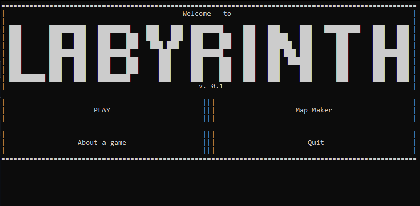
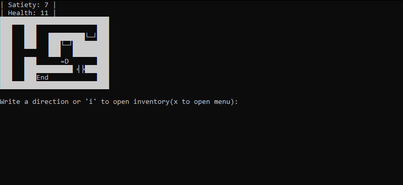
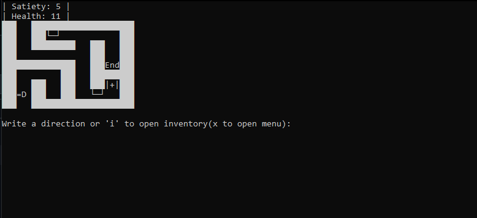
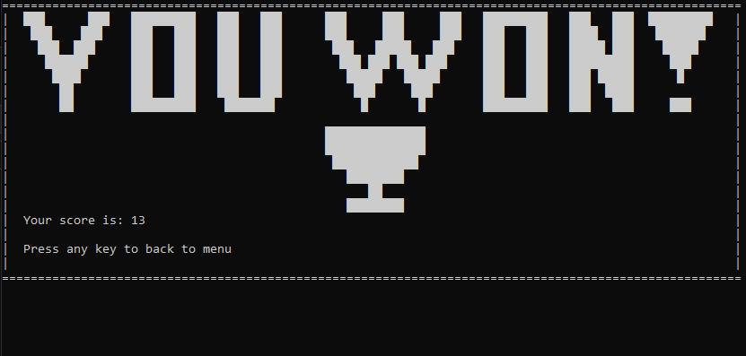

  <h1>The Labyrinth Game</h1> 
  
  
  
  ## What is it?
  This is a labyrinth quest in Terminal, what I made just4fun on C#. IN-DEV!!!

  ### Plot
  You are a typical knight in 13th century France. You tried to make revolution and overthrow the king with your allies, but all of you were jailed into the big fortress labyrinth. Your main goal is go away from the labyrinth and win the boss - L...
  
  

  ---

  ### What are these symbols?
   =D - This is **you**. You can walk by wasd and watch your inventory by i.
   
   <nocode>></nocode>=P - This is **your enemy**. You need to kill him by sword or you will die.
   
   **╡╞** - This is **a sword**. By this thing you can kill your enemies but it will dissapeas after one use.
   
   **End** - This is **the end** of the labyrinth. After you'll go there you will go to the next level.
   
   **└─┘** - This is **the bowl**. If you will take it, you won't be hungry!
   
   **|+|** - This is **a medicine box**. Take it, and you'll get +1 Health.
   
   **^^^** - These are **spikes**. You'll fall to them, if you don't have a bridge. And yeah, it is - III.
   
   **╓─▌**, ***/*** - These are **key** and **lock**. Lock locks ways, key opens ways.
   
   

   ---

   ### Can i make own mode of this game?
   Yes, of course! If you'd like to make own variation of this game, go <a href="https://github.com/aelog/the-labyrinth-game-mediveal/blob/main/scr/for-mode-makers.md">here</a>
   
   

   ---

## Systems
### Windows
There it is working. Just [install](install/labyrinth.exe) it!

### Linux/ReactOS/Other UNIX
Wine: !!!not tested!!!

PlayOnLinux: !!!not tested!!!

Mono: tested, only one problem - Console.Clear() is not working

### MacOS
I don't have Macbook and I can't test it. If you tested it on MacOS - say it for me pls

